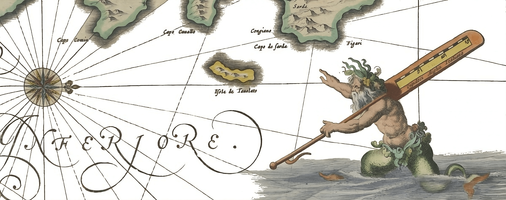
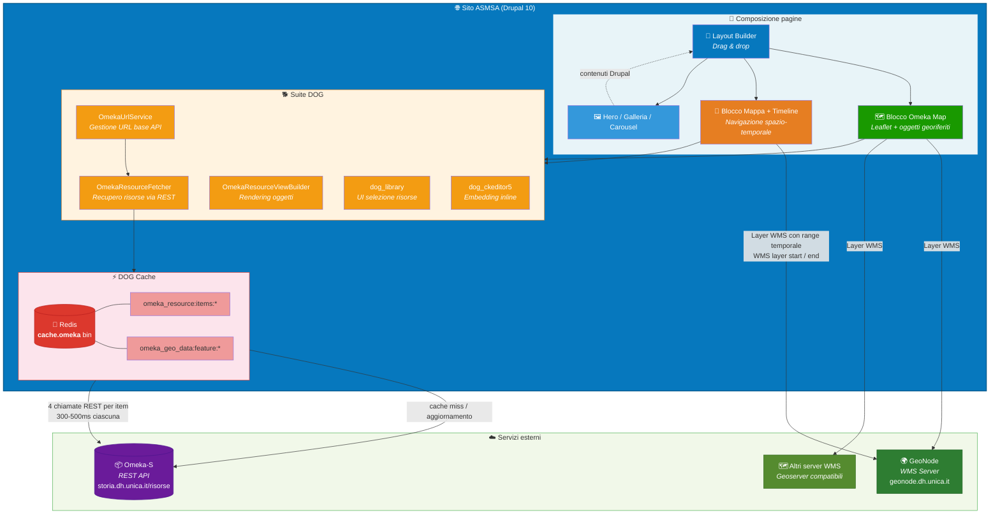

# Atlante digitale di Storia Marittima del Regno di Sardegna

### Patrimonio culturale digitale su mappe interattive e timeline

---

*Un progetto del [DH UniCA](https://dh.unica.it) — Centro Interdipartimentale per l'Umanistica Digitale dell'Universita degli Studi di Cagliari*
*Direttore Prof. Giampaolo Salice*

---

## Il progetto

L'**Atlante digitale di Storia Marittima del Regno di Sardegna** (ASMSA) e un sito web per la valorizzazione del patrimonio culturale digitale legato alla storia marittima della Sardegna. Il progetto combina **mappe interattive**, **timeline**, documenti d'archivio, immagini, video e audio per consentire a ricercatori e cittadini di esplorare la storia marittima sarda attraverso la dimensione spaziale e temporale.

Le collezioni digitali — metadatate secondo standard internazionali (Dublin Core) — sono gestite sulla piattaforma **Omeka-S** e vengono integrate nel sito Drupal attraverso la suite di moduli **DOG**. I livelli cartografici storici provengono da server **GeoNode** e vengono sovrapposti alle mappe base, permettendo di visualizzare l'evoluzione del territorio nel tempo.

Il tema grafico e conforme al **Design System della Pubblica Amministrazione italiana** (linee guida AGID) grazie a Bootstrap Italia.

### Cosa offre il sito

- **Mappe interattive** con oggetti georiferiti provenienti dalle collezioni digitali Omeka-S
- **Timeline sincronizzate** che permettono di navigare gli eventi nel tempo e nello spazio contemporaneamente
- **Layer cartografici storici** (WMS) sovrapposti alle mappe, con visibilita legata all'arco temporale selezionato
- **Gallerie fotografiche** di documenti d'archivio, dipinti, fotografie storiche
- **Contenuti multimediali** (audio, video, documenti) collegati a punti sulla mappa
- **Pagine editoriali** composte liberamente dai redattori tramite il Layout Builder di Drupal

---

## DOG — La suite di moduli Drupal

**DOG** (**D**rupal + **O**meka-S + **G**eonode) e la suite di moduli custom che rende possibile l'integrazione tra le tre piattaforme. E il cuore tecnologico del progetto: un applicativo open source che permette di comporre pagine web in modo visuale, integrando livelli cartografici esposti con GeoNode e oggetti Omeka-S preventivamente metadatati, disponendoli anche su una linea temporale integrata con la mappa.

> *"Salire sulle spalle dei giganti"* — Invece di costruire da zero, DOG sfrutta le basi solide di tre piattaforme open source consolidate (Drupal, Omeka-S, GeoNode), ciascuna eccellenza nel proprio ambito, connettendole in un unico ecosistema.

DOG e riutilizzabile: qualsiasi istituzione culturale, universita o centro di ricerca puo adottarlo per costruire il proprio atlante digitale collegandolo alla propria istanza Omeka-S e ai propri geoserver.

### Le tre componenti integrate

**Drupal** — CMS open source (dal 2001). Gestisce il sito web, i contenuti e il layout delle pagine tramite il **Layout Builder**, un sistema drag-and-drop che consente ai redattori di comporre pagine personalizzate senza competenze tecniche.

**Omeka-S** — CMS per oggetti digitali (dal 2008). Piattaforma GLAM (Galleries, Libraries, Archives, Museums) per archiviare, gestire e presentare oggetti digitali con metadati strutturati secondo standard internazionali (Dublin Core). Le collezioni dell'Atlante sono ospitate su `storia.dh.unica.it/risorse`.

**GeoNode** — Server web di mappe geografiche (dal 2010). Piattaforma open source per dati geografici. DOG integra informazioni da GeoNode e da qualsiasi geoserver che esponga layer secondo il formato **WMS** (Web Map Service).

---

## Architettura e flusso dati

> **Come leggere il diagramma**: Il redattore compone le pagine tramite il Layout Builder, aggiungendo blocchi mappa e timeline. I moduli DOG recuperano gli oggetti dalla cache Redis; se la cache e vuota o in aggiornamento, le chiamate vengono inoltrate alle API REST di Omeka-S. I layer cartografici WMS vengono caricati direttamente da GeoNode.

### Il connettore Drupal — Omeka-S

Il cuore dell'integrazione e il modulo custom **`dog`** che funge da connettore tra Drupal e Omeka-S. La connessione viene configurata tramite l'interfaccia di amministrazione:

**`Amministrazione > Configurazione > Webservice > Drupal Omeka Geonode`**

dove si impostano:

- **Base URL** dell'istanza Omeka-S pubblicata su internet (es. `https://storia.dh.unica.it/risorse/`)
- **API Key Identity** (facoltativo, per servizi non pubblici)
- **API Key Credential** (facoltativo)

Il sistema verifica automaticamente la raggiungibilita della risorsa al salvataggio della configurazione. La funzione di browsing e ricerca nelle API avviene in tempo reale e riguarda solo gli item in stato pubblicato.

### Come funziona il flusso dati

Per ogni singolo elemento interrogato su Drupal sono necessarie **quattro chiamate REST separate** verso Omeka-S. Le API di Omeka richiedono dai 300 ai 500 ms per chiamata, a causa della complessa struttura relazionale del database.

#### Versione 1.0 — Chiamate in tempo reale

Nella prima versione, Drupal interrogava dinamicamente i database di Omeka e GeoNode ad ogni caricamento di pagina. Questo garantiva dati sempre aggiornati ma causava rallentamenti significativi oltre i 20 oggetti Omeka per pagina.

#### Versione 2.0 — Sistema di cache intelligente

La versione attuale introduce la **DOG Cache**, un layer di cache dedicato con le seguenti caratteristiche:

- **Interna a Drupal** e trasparente rispetto al livello superiore, garantendo piena compatibilita con le pagine create nella versione 1.0
- **Componente architetturale dedicato** basato su **Redis**, con alta scalabilita
- **Cache separata e autonoma** rispetto alle altre cache Drupal, con persistenza indipendente e invalidazione controllata
- **Aggiornamento manuale o schedulato**: i redattori decidono quando sincronizzare la cache con i dati presenti in Omeka

Due entita principali vengono messe in cache:

| Entita | Cache Key |
|--------|-----------|
| Item Omeka | `cache_omeka: omeka_resource:items:*` |
| Feature geografiche | `cache_omeka: omeka_geo_data:feature:*` |

L'aggiornamento avviene tramite il pannello di controllo DOG (`/admin/config/services/dog-settings`) con i pulsanti **"Update Items Cache Now"** e **"Update Features Cache Now"**, oppure tramite job schedulati (cron).

> Dai test effettuati, **150 oggetti vengono renderizzati in circa 900ms**. Il limite teorico e di **1500-2000 oggetti Omeka per pagina** con un caricamento asincrono sotto i 10 secondi.

---

## Blocchi contenuto disponibili

I redattori possono comporre le pagine dell'Atlante tramite il Layout Builder, aggiungendo diversi tipi di blocco:

| Blocco | Descrizione |
|--------|-------------|
| **Blocco base** | Editor WYSIWYG per testo formattato |
| **Carousel** | Carosello di immagini |
| **Galleria** | Griglia fotografica a 3 colonne con link interni/esterni |
| **Hero** | Banner visivo prominente con titolo, testo, CTA e immagine di sfondo |
| **Map** | Mappa Leaflet base |
| **Omeka Map** | Mappa con oggetti Omeka georiferiti, contenuti Drupal, media e layer WMS |
| **Omeka Map Timeline** | Mappa + timeline sincronizzata con oggetti posizionati per data (`dcterms:data`) |

### Blocco Omeka Map

Il blocco piu caratteristico di DOG. Consente di posizionare su una mappa Leaflet:

- **Oggetti Omeka-S** georiferiti, selezionati dal redattore tramite una finestra modale con ricerca e filtro per collection
- **Contenuti Drupal** interni al sito, referenziati tramite autocomplete
- **Media** (audio, documenti, immagini, video remoti) inseriti nella libreria del sito
- **Layer WMS** da server GeoNode o qualsiasi geoserver compatibile

### Blocco Omeka Map Timeline

Ha le stesse funzionalita del blocco mappa, con in aggiunta una **timeline** sotto la mappa. Gli oggetti vengono posizionati sulla timeline in base al valore `dcterms:data` indicato su Omeka. E possibile:

- Definire un **arco temporale** per ogni layer WMS (WMS layer start / WMS layer end)
- Navigare la timeline e vedere i **layer WMS cambiare automaticamente** in base al periodo selezionato
- Esplorare simultaneamente la dimensione **spaziale e temporale** dei dati

---

## Moduli custom DOG

Il codice della suite DOG risiede in `web/modules/custom/`:

| Modulo | Percorso | Funzione |
|--------|----------|----------|
| **dog** | `web/modules/custom/dog/` | Modulo principale. Cache dedicata, servizi (`OmekaResourceFetcher`, `OmekaUrlService`, `OmekaResourceViewBuilder`), field type/widget/formatter, Views plugin, form di configurazione |
| **dog_library** | `web/modules/custom/dog/modules/dog_library/` | Integrazione Layout Builder e UI di selezione risorse Omeka |
| **dog_ckeditor5** | `web/modules/custom/dog/modules/dog_ckeditor5/` | Plugin CKEditor 5 per embedding inline di risorse Omeka |
| **omeka_utils** | `web/modules/custom/omeka_utils/` | Utility API legacy (in dismissione progressiva) |

---

## Stack tecnologico

| Componente | Tecnologia | Versione |
|------------|------------|----------|
| CMS | Drupal | 10.1+ |
| Runtime | PHP | 8.2 |
| Database | MariaDB | 10.11 |
| CLI Drupal | Drush | 12.1+ |
| Build frontend | Node.js + Webpack | 18+ |
| Tema | Bootstrap Italia | 2.6.0 |
| Mappe | Leaflet | - |
| Cache | Redis | - |
| Container | Docker Compose | - |
| Web server | Apache | 2.4 |
| Editor | CKEditor | 5 |

---

## Conformita PA italiana

Il sito utilizza il tema **Bootstrap Italia**, sviluppato secondo le [linee guida AGID](https://docs.italia.it/italia/designers-italia/design-linee-guida-docs/it/stabile/index.html) per i siti della Pubblica Amministrazione italiana. Il tema e stato personalizzato per adattarsi alle esigenze dell'Atlante e ai componenti DOG (blocchi mappa, timeline, selettore risorse Omeka).

---

## Documentazione

| Documento | Descrizione |
|-----------|-------------|
| [Guida all'uso DOG v2.0](docs/DOG%20DH%20UNICA%20-%20GUIDA%20ALL'USO%20-%20DOCUMENTAZIONE%20V.2.0.pdf) | Documentazione completa: architettura, componenti, istruzioni per i redattori, FAQ |
| [Guida breadcrumb](docs/manuale-breadcrumb.md) | Configurazione navigazione breadcrumb |

---

## Licenza

Progetto **open source** sviluppato dal [DH UniCA](https://dh.unica.it) — Centro Interdipartimentale per l'Umanistica Digitale dell'Universita degli Studi di Cagliari.

---

*Sviluppato con passione per le Digital Humanities*

**DH UniCA** | Via Is Mirrionis 1 - 09127 Cagliari (Italy)

